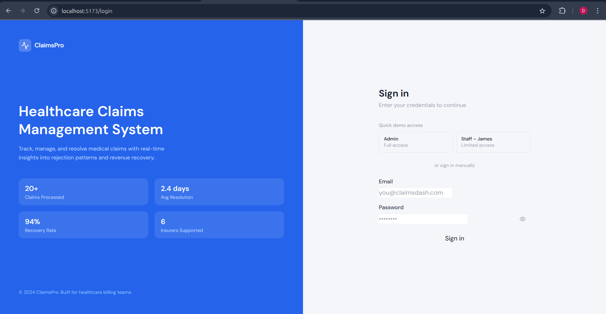
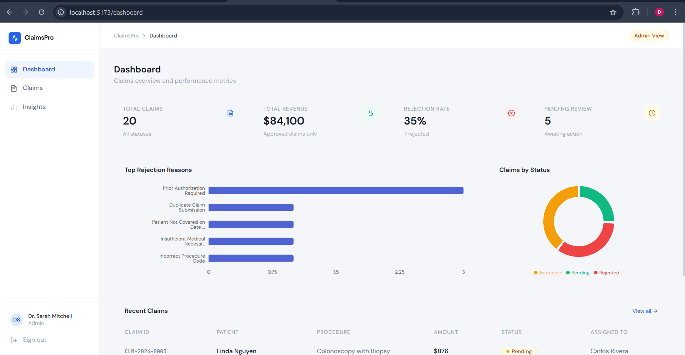
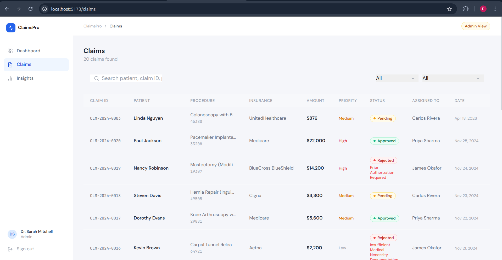
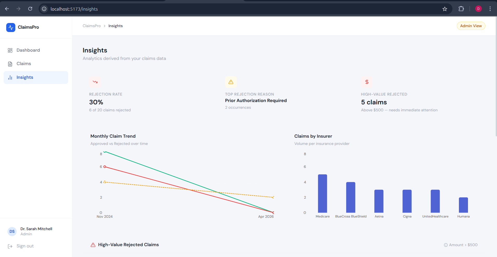
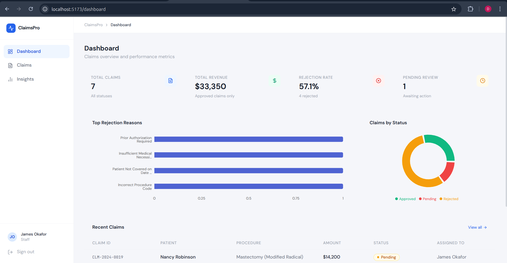

# 🏥 ClaimsPro — Healthcare Claims Insight Dashboard

A production-style **MERN stack** web application that simulates real-world medical billing workflows. Built to demonstrate practical understanding of healthcare revenue cycle management (RCM) systems used by billing departments in hospitals and insurance companies.

---

## 📸 Screenshots

### Login Page


### Admin Dashboard


### Claims Management


### Insights & Analytics


### Staff View (Role-Based Access)


---

## 🧩 Problem

Healthcare billing teams process hundreds of medical claims daily. Each claim goes through a lifecycle — submitted, reviewed, approved or rejected by insurance providers. Without a centralized system:

- Rejected claims go untracked and revenue is lost
- Staff have no visibility into their workload
- Managers can't identify patterns in rejections
- High-value rejected claims slip through without priority handling

---

## 💡 Solution

ClaimsPro provides a centralized dashboard where billing admins and staff can:

- Track every claim through its full lifecycle
- Instantly identify rejection reasons and patterns
- Fix and resubmit rejected claims in one click
- See analytics that reflect real revenue recovery metrics
- Access role-scoped views so staff only see what's relevant to them

---

## ✨ Features

### 🔐 Authentication & Role-Based Access
- JWT-based authentication (stored in `localStorage`, sent via `Authorization: Bearer` header)
- Two roles: **Admin** and **Staff**
- Admin sees all claims across all staff
- Staff sees only claims assigned to them
- Role enforcement at **both API and UI level**

### 📋 Claims Management
- Full claims table with real CPT procedure codes and ICD-10 diagnosis codes
- Color-coded status badges: `Approved` / `Pending` / `Rejected`
- Inline rejection reason display
- Search by patient name, claim ID, or procedure
- Filter by status and insurance provider
- **Fix & Resubmit** button for rejected claims (admin only)
- Resubmission count tracking per claim

### 📊 Dashboard
- Summary cards: Total Claims, Total Revenue, Rejection Rate, Pending Count
- Rejection reasons bar chart
- Claims by status donut chart
- Recent claims quick-view table

### 🔍 Insights
- Rejection rate percentage
- Most common rejection reason
- High-value rejected claims (> $500) — prioritized for recovery
- Monthly claim trend (Approved vs Rejected over time)
- Claims volume by insurance provider
- Rejection reason breakdown with visual progress bars

---

## 🗂️ Project Structure

```
healthcare-claims-dashboard/
├── backend/
│   ├── src/
│   │   ├── controllers/
│   │   │   ├── authController.js      # Login, getMe, getUsers
│   │   │   └── claimsController.js    # CRUD, resubmit, analytics
│   │   ├── routes/
│   │   │   ├── authRoutes.js
│   │   │   └── claimsRoutes.js
│   │   ├── models/
│   │   │   ├── User.js                # Mongoose schema + bcrypt
│   │   │   └── Claim.js               # Full claim schema with indexes
│   │   ├── middleware/
│   │   │   ├── auth.js                # JWT protect + restrictTo
│   │   │   └── errorHandler.js        # Global error handler
│   │   ├── seed/
│   │   │   └── seeder.js              # 20 realistic claims + 4 users
│   │   └── app.js                     # Express entry point
│   ├── .env.example
│   ├── Dockerfile
│   └── package.json
│
├── frontend/
│   ├── src/
│   │   ├── context/
│   │   │   └── AuthContext.jsx        # Global auth state
│   │   ├── services/
│   │   │   └── api.js                 # Axios instance + interceptors
│   │   ├── components/
│   │   │   ├── Layout.jsx             # Sidebar + topbar shell
│   │   │   ├── ProtectedRoute.jsx
│   │   │   ├── StatusBadge.jsx
│   │   │   └── SummaryCard.jsx
│   │   ├── pages/
│   │   │   ├── Login.jsx
│   │   │   ├── Dashboard.jsx
│   │   │   ├── Claims.jsx
│   │   │   └── Insights.jsx
│   │   ├── App.jsx
│   │   ├── main.jsx
│   │   └── index.css
│   ├── vite.config.js
│   ├── tailwind.config.js
│   ├── Dockerfile
│   └── package.json
│
├── docker-compose.yml
└── README.md
```

---

## 🛠️ Tech Stack

| Layer      | Technology                          |
|------------|-------------------------------------|
| Frontend   | React 18, Vite, Tailwind CSS        |
| Charts     | Recharts                            |
| Routing    | React Router v6                     |
| HTTP       | Axios (with interceptors)           |
| Backend    | Node.js, Express.js                 |
| Database   | MongoDB + Mongoose ODM              |
| Auth       | JWT (JSON Web Tokens) + bcryptjs    |
| DevOps     | Docker, Docker Compose              |

---

## 🚀 Getting Started

### Prerequisites
- Node.js 18+
- MongoDB running locally or a MongoDB Atlas URI
- npm

---

### 1. Clone the repo

```bash
git clone https://github.com/0xdanyal/healthcare-claims-dashboard.git
cd healthcare-claims-dashboard
```

---

### 2. Backend Setup

```bash
cd backend
cp .env.example .env
```

Edit `.env`:
```env
MONGO_URI=mongodb://localhost:27017/healthcare_claims
PORT=5000
JWT_SECRET=your_super_secret_key
```

```bash
npm install
npm run seed     # Seeds 20 claims + 4 users
npm run dev      # Starts on http://localhost:5000
```

---

### 3. Frontend Setup

```bash
cd frontend
npm install
npm run dev      # Starts on http://localhost:5173
```

> Vite proxies all `/api` requests to `localhost:5000` automatically.

---

### 4. Docker (Optional)

```bash
# From project root
docker-compose up --build
```

---

## 🔑 Demo Credentials

| Role    | Email                   | Password     |
|---------|-------------------------|--------------|
| Admin   | admin@claimsdash.com    | Admin@1234   |
| Staff   | james@claimsdash.com    | Staff@1234   |
| Staff   | priya@claimsdash.com    | Staff@1234   |
| Staff   | carlos@claimsdash.com   | Staff@1234   |

---

## 🔌 API Reference

### Auth
| Method | Endpoint          | Access       | Description              |
|--------|-------------------|--------------|--------------------------|
| POST   | `/api/auth/login` | Public       | Login, returns JWT       |
| GET    | `/api/auth/me`    | Private      | Get current user         |
| GET    | `/api/auth/users` | Admin only   | Get all staff users      |

### Claims
| Method | Endpoint                       | Access     | Description                    |
|--------|--------------------------------|------------|--------------------------------|
| GET    | `/api/claims`                  | Private    | Get claims (role-filtered)     |
| GET    | `/api/claims/:id`              | Private    | Get single claim               |
| GET    | `/api/claims/analytics`        | Private    | Get dashboard analytics        |
| PATCH  | `/api/claims/:id/status`       | Admin only | Update claim status            |
| PATCH  | `/api/claims/:id/resubmit`     | Admin only | Fix & resubmit rejected claim  |

---

## 🏥 How This Reflects Real Healthcare Billing Systems

| Real System Concept         | Implementation in ClaimsPro                              |
|-----------------------------|----------------------------------------------------------|
| CPT Procedure Codes         | Each claim has a real CPT code (e.g., `93510`, `27447`) |
| ICD-10 Diagnosis Codes      | Each claim has a diagnosis code (e.g., `I25.10`)        |
| Insurance Payer Management  | Claims linked to real US insurers (Aetna, Medicare...)  |
| Claim Lifecycle             | Pending → Approved / Rejected → Resubmit → Pending      |
| Rejection Reason Tracking   | Standard denial reasons used by real payers             |
| Resubmission Count          | Tracks how many times a claim has been resubmitted      |
| Role-Based Access (RBAC)    | Billing staff vs admin — enforced at DB query level     |
| Revenue Recovery Metric     | Total revenue calculated from approved claims only      |
| Priority Triage             | High-value rejected claims flagged for fast recovery    |

---

## 👨‍💻 Author

**Danyal**
Built as a practical project to understand healthcare billing systems and MERN stack development.

---

## 📄 License

MIT — free to use, modify, and distribute.